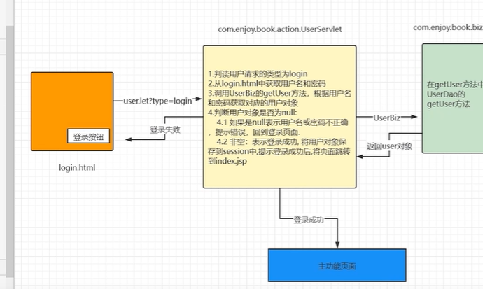
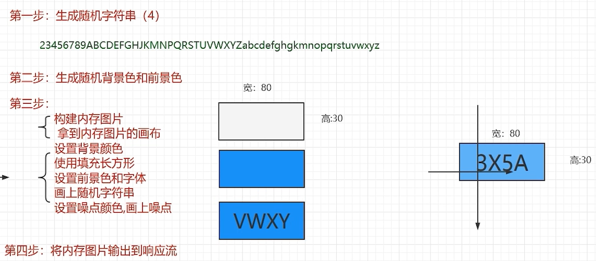

- 项目整体架构图  

  
  

- 项目结构
  - dao层：负责与数据库的基本操作，不能进行信息的补全
  - biz层：业务层由biz层实现，将多个业务点融合
  
  
- 导包  
UserDao可以直接访问lib下的jar包,但是servlet不能直接访问，需要在项目结构->工件->输出布局，将可用元素的jar包复制一份到输出根中
- 验证码生成  

    注意：此时使用左下角为原点开始的，和传统的css稍有不同(css是以左上角为原点)  
  验证码设置不区分为大小写
- 验证码点击更换(前端)  
jQuery的框架
  ```javascript
  <script language="javascript" src="Js/jquery-3.3.1.min.js"></script>  
  ```
- TypeBiz  
  type是book的一个外键，如果要删除一个类型，就要判断该类型下是否有此类型的图书  
  如果有：提示删除失败，否则成功删除
  


